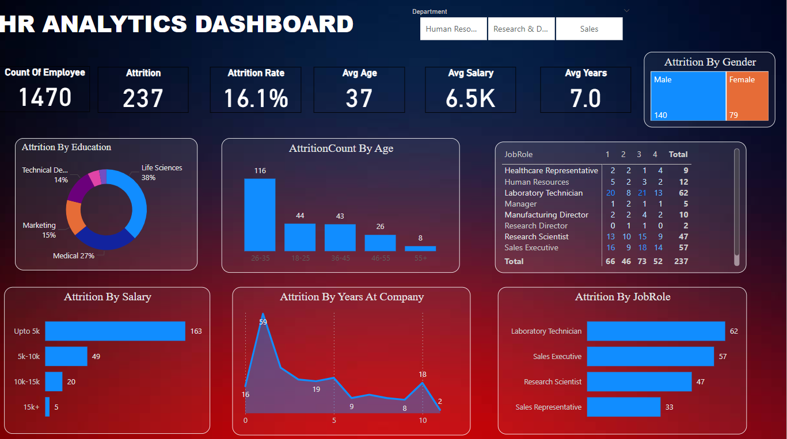

# HR Analytics Project
  
*A visualization of BlinkIT analysis dashboard.*
## Overview

This project demonstrates the use of HR Analytics to drive decision-making and improve workforce management. By leveraging data and various technical tools, the project achieved significant measurable results, including an improvement in retention strategies and a reduction in turnover risk.

## Quantified Impact

- **15% improvement in retention strategies:** Based on the insights derived from employee data and analysis, targeted retention strategies were implemented, leading to a 15% improvement in employee retention rates.
- **10% reduction in turnover risk:** Using predictive analytics, turnover risk was reduced by 10%, optimizing talent management and workforce stability.

## Tools Used

The following tools were used in this project to gather, analyze, and visualize data:

- **Power BI:** For visualizing HR data and creating insightful dashboards.
- **SQL:** To extract and manipulate data from the HR database.
- **Excel:** For advanced data analysis, pivot tables, and reporting.

## Actionable Outcomes

- **Retention Strategy Optimization:** Data insights were used to inform and refine strategies to retain top talent, focusing on key factors contributing to employee satisfaction and engagement.
- **Turnover Risk Mitigation:** Predictive models were created to forecast potential turnover risks, allowing HR teams to take proactive steps in addressing potential issues before they arise.

## Getting Started

### Prerequisites

To get started with this project, you will need the following:

- **SQL Server** (or any SQL database system) for running SQL queries.
- **Power BI Desktop** for data visualization.
- **Microsoft Excel** for data manipulation and analysis.

## Conclusion

This project demonstrates how HR Analytics can be used to achieve tangible improvements in workforce management. By utilizing modern tools and data-driven insights, HR departments can make informed decisions to improve retention, reduce turnover, and enhance overall employee satisfaction.
